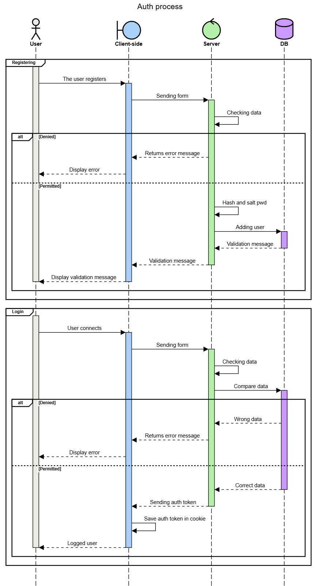

# Crypto

GERARD Alexandre
Metz Numeric School
2024
______

## RSA Encryption and Decryption Script

This Python script provides the encryption/decrypting of files using RSA algorithm. It uses the `cryptography` library to handle cryptographic operations.

### Usage

The script can be run from the command line with the following usage:

```sh
python ransom.py <encrypt/decrypt> <file_path>
```

#### Arguments

- `<encrypt/decrypt>`: Specify "encrypt" to encrypt a file or "decrypt" to decrypt a file.
- `<file_path>`: Path to the file to be encrypted or decrypted.

#### Steps

1. Checks the number of command-line arguments.
2. Calls `generate_keys()` if the RSA key files do not exist.
3. Based on the specified action (`encrypt` or `decrypt`), calls the appropriate function (`encrypt_file` or `decrypt_file`).

### Usage

```bash
python ransom.py <encrypt/decrypt> <file_path>
```

### Functions

#### `generate_keys()`

Generates a pair of RSA keys (private and public) and saves them to `private_key.pem` and `public_key.pem` files, respectively.

#### `encrypt_file(file_path)`

Encrypts a file using the public RSA key.

#### Parameters

- `file_path` (str): Path to the file to be encrypted.

#### Steps

1. Loads the public key from `public_key.pem`.
2. Reads the plaintext from the specified file.
3. Encrypts the plaintext using the public key with OAEP padding and SHA-256.
4. Writes the encrypted data to a new file with a `.enc` extension.
5. Deletes the original file.
6. Prints a confirmation message.

#### `decrypt_file(file_path)`

Decrypts a file using the private RSA key.

#### Parameters

- `file_path` (str): Path to the encrypted file (must have a `.enc` extension).

#### Steps

1. Checks if the file has a `.enc` extension.
2. Loads the private key from `private_key.pem`.
3. Reads the ciphertext from the specified file.
4. Decrypts the ciphertext using the private key with OAEP padding and SHA-256.
5. Writes the decrypted data to a new file (original filename without the `.enc` extension).
6. Deletes the encrypted file.
7. Prints a confirmation message.

## Authentification Demo App

This app shows the implementation of authentication features in both a client-side and a server-side.
The app is divided into two main parts:

- The client (React TS)
- The server (Node JS / Express)

### Usage

```bash
nvm use
npm i
npm run start
```

### Database Structure

The database stores user information with the following schema:

#### Users Collection

```js
{
  "user_id": "ObjectId(Users)",
  "email" : "string",
  "password": "string",
  "refreshTokens": "string[]"
}
```

### Environment Configuration

The application uses environment variables to configure the connection to the database and JWT keys.

#### .env client file

```txt
PORT=3200 (Default)

MONGODB_TABLE= YOUR_DB_TABLE
MONGODB_DBNAME= YOUR_DB_NAME 
MONGODB_PWD= YOUR_DB_PASSWORD 
MONGODB_USER= YOUR_DB_USER

JWT_AUTH_KEY= YOUR_JWT_KEY
JWT_REFRESH_KEY= YOUR_JWT_REFRESH_KEY
```

### Authentication Process

Full authentication process is described in the following sequence diagram.



### Encryption Techniques

### JWT (JSON Web Tokens)

JWTs are used for secure token-based authentication. The tokens are signed with secret keys and include a payload containing user information. The algorithm used in this case is HS256.

### Bcrypt

Bcrypt is used for hashing and salting passwords before storing them in the database. It uses the Blowfish cypher algorithm to hash and a cost factor of 10 for salting to buy time in case of database breaches (ie. rainbow tables).

## Homemade DES

This last program is a homemade DES that is basically a symmetric-key algorithm that encrypts data.

### Usage

```bash
nvm use
npm i
npm run start
```

### Key Definitions

- **INPUT**: A 16-bit binary string representing the message to be encrypted.
- **KEY**: A 12-bit array representing the encryption key.

### Execution

The `main` function orchestrates the entire encryption process by performing the following steps:

1. **Generate Subkeys**: Uses the `generateSubkeys` function to derive 16 subkeys from the original encryption key.

2. **Initial Split**: Splits the 16-bit input message into two 8-bit parts (`li` and `ri`).

3. **Round Function Execution**: Iterates through 16 rounds, performing the following operations :

    - **Expansion**: Expands the 8-bit `ri` to 12 bits using the `expand` function.
    - **XOR with Subkey**: XORs the expanded `ri` with the current round's subkey.
    - **S-box Transformation**: Applies S-box transformations (`sbox1` and `sbox2`) on the XOR result.
    - **Permutation**: Permutes the S-box output using the `permute` function.
4. **Output Formation**: Concatenates and rearranges `li` and `ri` to form the final 16-bit encrypted message.

5. **Output**: Prints the final encrypted message to the console.
